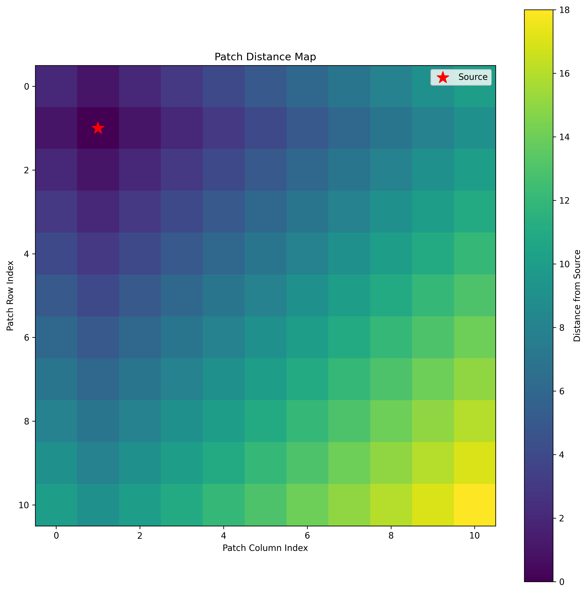

# Implementing E&M Simulators

E&M is largely governed by Maxwell's equations, a set of partial differential equations that describe the behavior of electric and mangetic fields.

Almost all E&M can be modeled by Maxwell's equations, and almost all other E&M phenomenon can be modeled this way. As a result, E&M simulators based on Maxwell's equations are widespread.

To start, let's look at Maxwell's curl equations.

$$
\nabla \times \mathbf{E} = - \frac{\partial \mathbf{B}}{\partial t} = -\mu \frac{\partial \mathbf{H}}{\partial t}
$$

$$
\nabla \times \mathbf{H} = \frac{\partial \mathbf{D}}{\partial t} = \epsilon \frac{\partial \mathbf{E}}{\partial t}
$$

However, getting from these equations to a simulation is not straightforward, and this blog post will walk through the process and motivation of implementing and optimizing a simulator in 2 dimensions. 

## Maxwell's Curl Equations in 2D

We can pick two polarizations of light in 2D, one where the electric field is perpendicular to the plane of the paper, and one where the electric field is in the plane of the paper. These are the TE and TM modes respectively. In the TE mode, the electric field only contains a $z$ component, and the change in the $z$ component $\frac{\partial E_z}{\partial t}$ is 0. In this case, we can expand the curl operator to be

$
\nabla \times \mathbf{E} = \begin{vmatrix}
\mathbf{i} & \mathbf{j} & \mathbf{k} \\
\frac{\partial}{\partial x} & \frac{\partial}{\partial y} & \frac{\partial}{\partial z} \\
E_x & E_y & E_z
\end{vmatrix}
$

## FDTD

## FDFD

FDTD is an extremely good way to solve Maxwell's equations for transient sources, but oftentimes in photonics simulations we are concenred about the state of a system after a very long time passes, or the steady state. Steady state solutions happen rapidly in light-matter simulations due to the high speed of light! The relation between time-domain and frequency-domain signals by the Fourier transform already gives a hint that we can solve for the steady state at a given frequency!

This is a really nice solution, since we often only care about the behavior of light with constant frequency sources such as a red laser!

We can then do this with a single matrix solve of the form $Ax = b$ where $A$ is a sparse matrix representing the discrete difference operator for Curl and $b$ is the source term.

However, this is a big matrix. The side length of the matrix is $N_x \times N_y$, leading to slow solve times. For a $1000 \times 1000$ grid, this is a $10^6 \times 10^6$ matrix, and the system takes around 13 seconds to solve on my laptop. Can we do better? Maybe we can! I have two proposed solutions:

### Diffusion Modelling

### Tiled FDFD

The uniqueness and existence theorem gives that the boundary conditions of a system are sufficient in determining the solution in the system. Maybe we can then solve for the solution in the area around the source, and then solve for the solution in patches adjacent to that, and so on and so forth. 

The image above shows the distance of each patch from the source patch (marked with a red star). The colors indicate how many patches away from the source each patch is, with lighter colors being further.
